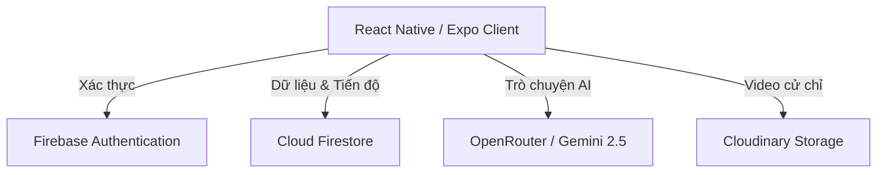
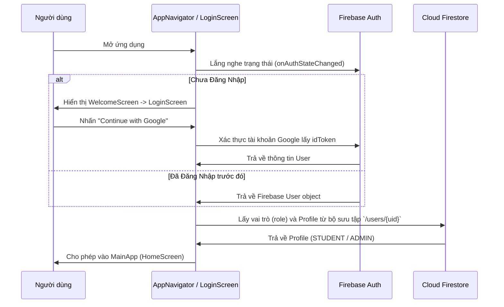
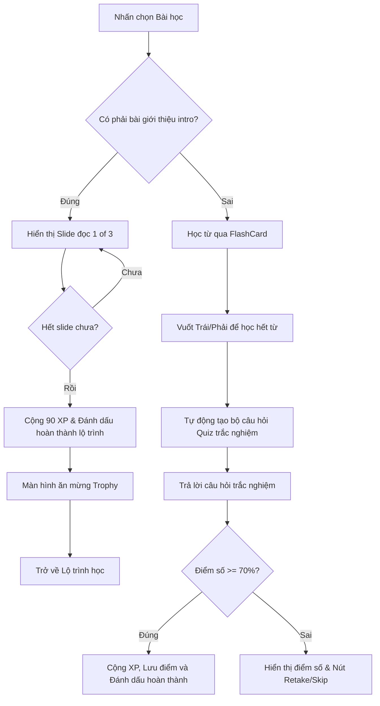
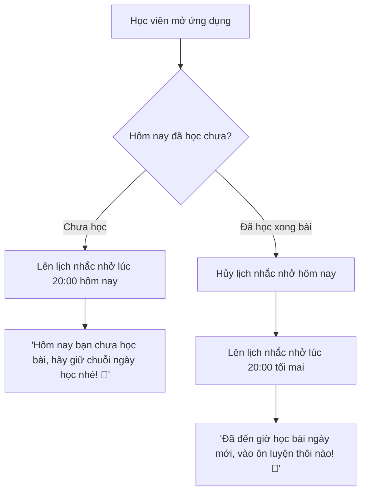
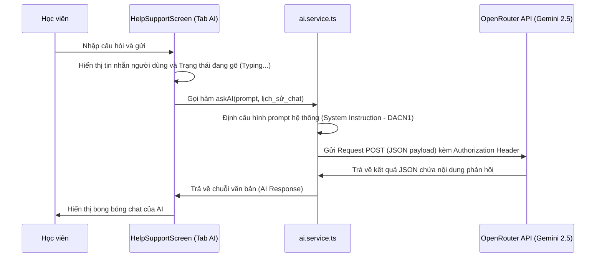

# TỔNG HỢP KIẾN TRÚC & HƯỚNG DẪN DỰ ÁN SIGNBRIDGE
*(Tài liệu ôn tập phục vụ Báo cáo Đồ án tốt nghiệp / DACN1)*

Tài liệu này cung cấp toàn bộ bức tranh kiến trúc hệ thống của ứng dụng **SignBridge**, từ công nghệ sử dụng, cấu trúc mã nguồn, luồng hoạt động chi tiết đến sơ đồ tương tác giữa các service và component.

---

## I. TỔNG QUAN HỆ THỐNG & CÔNG NGHỆ (TECH STACK)

SignBridge được xây dựng theo mô hình di động đa nền tảng hiện đại, sử dụng cơ chế lưu trữ đám mây thời gian thực và tích hợp trí tuệ nhân tạo (AI):



### 1. Frontend (Client Mobile)
*   **React Native & Expo (v54):** Bộ khung phát triển ứng dụng di động đa nền tảng (Android/iOS). Sử dụng Expo giúp quản lý vòng đời ứng dụng và tăng tốc độ phát triển.
*   **TypeScript:** Ngôn ngữ lập trình chính, giúp kiểm soát kiểu dữ liệu nghiêm ngặt, tự động hoàn thành mã (IntelliSense) và hạn chế tối đa lỗi runtime.
*   **React Navigation (v7):** Bộ điều hướng chuyên nghiệp bao gồm Stack Navigation (điều hướng ngăn xếp trang) và Bottom Tab Navigation (thanh menu điều hướng dưới cùng).
*   **Zustand:** Thư viện quản lý trạng thái toàn cục (Global State Management) cực kỳ nhẹ, dùng để lưu trữ trạng thái đăng nhập (`authStore`) và tiến độ học tập (`progressStore`) thay vì dùng React Context nặng nề.

### 2. Backend & Database (BaaS)
*   **Firebase Authentication:** Quản lý tài khoản người dùng, hỗ trợ Đăng nhập bằng Email/Password truyền thống và Đăng nhập nhanh bằng tài khoản Google.
*   **Cloud Firestore:** Cơ sở dữ liệu tài liệu NoSQL lưu trữ thông tin lộ trình học (`paths`), từ vựng cử chỉ (`signs`), bài học (`lessons`), và tiến độ học tập của từng học viên (`users`).
*   **Cloudinary:** Nền tảng lưu trữ đám mây tốc độ cao được dùng để lưu trữ các video cử chỉ mẫu định dạng `.mp4` nhằm giảm tải băng thông và dung lượng cài đặt của ứng dụng.

### 3. AI Engine (Trí tuệ nhân tạo)
*   **OpenRouter API:** Trung gian kết nối API của mô hình **`google/gemini-2.5-flash`** với tốc độ cực nhanh, phí duy trì siêu rẻ, giải quyết triệt để lỗi hạn mức `limit: 0` của tài khoản Google Cloud miễn phí.

---

## II. CẤU TRÚC THƯ MỤC DỰ ÁN

Mã nguồn được phân tổ theo cấu trúc mô-đun hóa khoa học dễ bảo trì:

```text
/2SignBridgeApp
├── .env                        # Chứa các API Key bí mật (Không đẩy lên Git!)
├── app.json                    # Cấu hình Expo, Bundle ID, Google Services file
├── google-services.json        # Cấu hình kết nối Firebase Android SDK
├── scripts/                    # Các công cụ/tiện ích dòng lệnh cho nhà phát triển
│   ├── seed.cjs                # Script dọn dẹp và nạp dữ liệu mẫu lên Firestore
│   └── resetProgress.cjs       # Tiện ích đặt lại tiến trình của người dùng qua terminal
└── src/                        # Thư mục chứa mã nguồn chính của ứng dụng
    ├── components/             # Các Component giao diện dùng chung
    │   ├── lesson/             # Thẻ bài học (FlashCard, QuizCard, LessonComplete)
    │   └── ui/                 # Component UI tĩnh (VideoModal, SentencePlayerModal)
    ├── config/                 # Cấu hình Firebase SDK
    ├── hooks/                  # Các Custom Hook React để bóc tách logic xử lý
    │   ├── useAuth.ts          # Quản lý sự kiện đăng nhập, đăng ký, Google Sign-in
    │   └── useProgress.ts      # Tính toán XP, chuỗi ngày học (streak) và lưu tiến độ
    ├── navigation/             # Bộ điều hướng của ứng dụng (AppNavigator.tsx)
    ├── screens/                # Giao diện các màn hình chức năng chính
    │   ├── HomeScreen.tsx      # Trang chủ (tiến trình, gợi ý từ, bảng xếp hạng)
    │   ├── LearningPathScreen.tsx # Lộ trình học (Bài học mở đầu, Từ vựng, Bảng chữ cái)
    │   ├── LessonScreen.tsx    # Giao diện học (Hiển thị slides, thẻ flashcard, quiz)
    │   ├── PracticeScreen.tsx  # Luyện tập cử chỉ qua camera (Tích hợp mô hình AI)
    │   ├── DictionaryScreen.tsx # Từ điển cử chỉ, kết hợp trình tạo câu ASL tự động
    │   ├── TranslationScreen.tsx# Trình dịch thủ ngữ trực tiếp (đang phát triển)
    │   ├── HelpSupportScreen.tsx# Trò chuyện trợ lý AI & FAQs thông tin đồ án
    │   └── ProfileScreen.tsx   # Trang cá nhân, lịch sử học tập & cài đặt hệ thống
    ├── services/               # Lớp tương tác với API và Database
    │   ├── auth.service.ts     # Các phương thức API Firebase Auth & Google Sign-In
    │   ├── ai.service.ts       # Service kết nối OpenRouter để trò chuyện AI
    │   ├── learning.service.ts # Lấy lộ trình học tập, bài học từ Firestore
    │   └── notification.service.ts # Quản lý thông báo đẩy cục bộ & Streak Reminder
    ├── store/                  # Lưu trữ trạng thái toàn cục qua Zustand
    ├── theme/                  # Định nghĩa bảng màu (Glassmorphism), cỡ chữ, khoảng cách
    └── types/                  # Định nghĩa kiểu TypeScript cho dữ liệu hệ thống
```

---

## III. LUỒNG HOẠT ĐỘNG CHÍNH (SYSTEM WORKFLOWS)

### 1. Luồng Xác thực & Khởi tạo (Authentication Flow)
Mô tả cách ứng dụng xử lý khi người dùng mở ứng dụng và đăng nhập:



### 2. Luồng Học tập & Bỏ qua Quiz bài mở đầu (Learning Flow)
Cơ chế học tập linh hoạt chuyển đổi giữa bài đọc giới thiệu không có trắc nghiệm và bài học từ vựng chuẩn:



### 3. Luồng Thông báo thông minh & Lập lịch Streak (Streak Reminder Flow)
Cơ chế tự động nhắc nhở thông minh tránh làm phiền và giữ chân học viên:



### 4. Luồng Trò chuyện với Trợ lý AI (AI Chat Flow)
Mô tả cách xử lý dữ liệu khi người dùng trò chuyện với Trợ lý AI:



---

## IV. SỰ TƯƠNG TÁC GIỮA CÁC SERVICE CHỨC NĂNG

### 1. Module Xác thực (Auth Module)
*   **`LoginScreen` / `WelcomeScreen` (Giao diện):** Cung cấp các nút nhập liệu, đăng nhập email/mật khẩu và nút "Continue with Google".
*   **`useAuth.ts` (React Hook):** Lớp trung gian chịu trách nhiệm đặt trạng thái loading, kiểm tra dữ liệu đầu vào (validation) và chuyển đổi các mã lỗi Firebase thành thông báo tiếng Việt thân thiện với người dùng.
*   **`auth.service.ts` (API Service):** Trực tiếp tương tác với Firebase SDK. Chứa phương thức `signInWithGoogle` chịu trách nhiệm gọi thư viện `@react-native-google-signin/google-signin` lấy `idToken`, hoán đổi token với Firebase Auth và khởi tạo tài liệu người dùng tại Firestore nếu là tài khoản mới.

### 2. Lớp Học tập & Tiến độ (Learning & Progress Module)
*   **`LearningPathScreen` / `LessonScreen` (Giao diện):** Hiển thị danh sách các bài học đã khóa/mở khóa. Hiển thị tiến trình phần trăm dạng thanh kéo Glassmorphism.
*   **`useProgress.ts` (React Hook):** Đồng bộ trực tiếp dữ liệu tiến độ từ Firestore. Cung cấp các hàm `completeLesson` và `completePath` để ghi nhận bài học/lộ trình hoàn thành.
*   **`learning.service.ts` (Database Service):** Thực hiện các truy vấn dữ liệu từ Firestore `/paths` và `/lessons` theo thứ tự `order` tăng dần để dựng lên lộ trình học tập.

### 3. Module Hỗ trợ Quản trị viên (Admin Tools)
*   **`seed.cjs` (Database Seeding Tool):** Script chạy độc lập phía server. Sử dụng quyền Admin (Firebase Admin SDK) để quét sạch lộ trình cũ và đồng bộ lại 56 từ vựng cùng 9 Lộ trình học tiêu chuẩn.
    *   *Đặc biệt:* Script có cơ chế đọc dữ liệu từ điển cũ để bảo vệ và **giữ nguyên các liên kết video Cloudinary** do học viên tải lên trước đó, không ghi đè video trống.
*   **`resetProgress.cjs` (Developer Utility):** Công cụ dòng lệnh hỗ trợ Admin khôi phục tiến trình học tập của bất kỳ học viên nào về 0% (xóa mảng hoàn thành trong Firestore `/users/{uid}`) chỉ bằng mã UID.

---

## V. CÁC TÀI LIỆU QUAN TRỌNG KÈM THEO
1.  **[walkthrough.md](file:///C:/Users/ASUS/.gemini/antigravity-ide/brain/6adcdd41-0817-4181-9291-e72ecf7c6d0f/walkthrough.md):** Nhật ký chi tiết toàn bộ các thay đổi sửa lỗi giao diện, cấu hình API Key và giải pháp cho lỗi trắng màn hình Introduction.
2.  **[sentence_visualizer_log.md](file:///d:/2SignBridgeApp/sentence_visualizer_log.md):** Tài liệu phân tích kỹ thuật và nhật ký xây dựng Trình dựng câu cử chỉ tự động bằng thuật toán phân tách ngữ pháp ASL.
